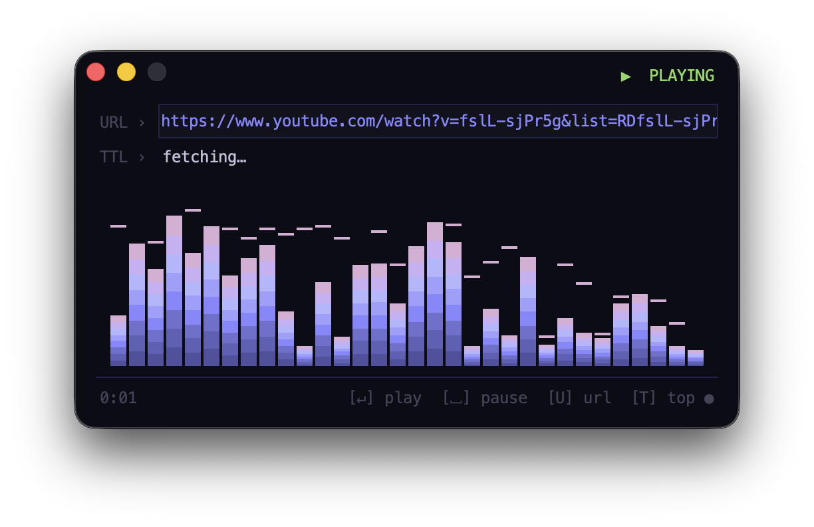

# lofi stream player

A minimal native macOS app for streaming internet radio and audio URLs, with an animated equalizer display.



## Requirements

- macOS 12 or later
- Python 3.13
- [mpv](https://mpv.io/) — audio playback engine
- [yt-dlp](https://github.com/yt-dlp/yt-dlp) — needed for YouTube/SoundCloud URLs and title fetching
- [py2app](https://py2app.readthedocs.io/) — used to build the app bundle

Install dependencies via Homebrew and pip:

```bash
brew install mpv yt-dlp
pip install py2app --break-system-packages
```

## Building the app

```bash
./build.sh
```

The script generates the icon, builds a proper macOS app bundle via py2app, and offers to install it to `/Applications`.

> On first launch macOS may block the app because it is unsigned. Go to **System Settings → Privacy & Security** and click **Open Anyway**.

## Running without building

You can also run the player directly from the terminal:

```bash
python3 lofi.py
```

## Usage

| Key | Action |
|-----|--------|
| `U` | Focus the URL field |
| `↵` | Play the entered URL |
| `Space` | Pause / resume |

Paste any direct audio stream URL or a YouTube/SoundCloud URL into the URL field and press Enter. The last played URL is remembered between sessions.

## Configuration

Settings are stored in `~/.config/lofi/config.json` and contain only the last used URL and title.
